> WARNING: Home Assistant integrations are updated often and the changes are very often breaking, this may not be accurate for long!

# Connecting a Logo8 to Home Assistant

A simple walkthrough of connecting a Siemens Logo8 PLC to Home Assistant using the Modbus protocol. This is aimed at a newbie like me who bought a Logo8 to try to learn a bit about [PLCs](https://en.wikipedia.org/wiki/Programmable_logic_controller) but has no real experience and also uses [Home Assistant](https://www.home-assistant.io/) to run their house (not a very large number of people!).

# Overview
I wanted to use a [Siemens Logo 8 PLC](https://new.siemens.com/global/en/products/automation/systems/industrial/plc/logo/logo-basic-modules.html#BasicModuleswithdisplay) to control the pump and sprinklers in the garden. It was easy enough to build a project in Logo!Soft which would run the pump and sprinklers in sequence. I also wanted to control the PLC via [Home Assistant](https://www.home-assistant.io/) with the ability to start and stop the sequence but also to override and turn a specific sprinkler on.

You can integrate Home Assistant with the Logo8 in a number of ways including via Node Red but I wanted to try and do it with no intermediary software and chose ot use the Modbus integration https://www.home-assistant.io/integrations/modbus/

There's a lot of information on the internet but it's all a bit spread around, so this is an attempt to do from scratch and flag the snags I hit.

I've detailed my specific integration for the sprinklers but the walkthrough is a simple [Hello World](#helloworld) below.

# The Setup
Home Assistant is running the latest version (currently 2022.8.6) in a container on a Raspberry Pi.

There is a water pump fed from some rainwater tanks. Attached to the pump are 7 water valves onto which, the pop up sprinklers are plumbed.

The Logo8! has an extra i/o module to support 8 relay swtiches. The valves use 24V AC and so a step down transformer is used to provide a 24V AC source which is switched by 7 of the relays (Q1 - Q7). The pump is switched via Q8 via a further relay to protect the Logo8 against a large motor load.

To turn on a sprinkler, the Logo8 has to turn on the pump motor (Q8) and also the relevant Valve (Q1 - Q7). There are a couple of limitations which mean that only 1 valve should be on at a time - the water pressure provided by the pump and the power supplied by the 24V AC transformer is limited.

When the sequence is running, the Logo8 switches on the pump and the first valve, after a period of time, it switches the valve off and turns on the next valve, looping through all the 7 valves until the sequence is stopped.

In its simplest form, the sequence could be made to start whenever power is applied to the Logo8 but I wanted more control and this is where the Modbus integration between the Logo8 and Home Assistant comes in. In my setup, the Logo8 is left running 24x7 and connected to the house LAN via Ethernet. Home Assistant then connects to the Logo8 and controls it via the Modbus protocol. This is the blueprint running on the Logo8

The blueprint running on the Logo8 includes a number of Flag blocks which act as swich inputs (the "M51" - "M57", "M60" and "M61" blocks on the left hand side of the diagram). These have a corresponding Modbus ID. The Logo8 is setup to run a Modbus server. Home Assistant is then configured to set the Flag block values to switch on and off the sequence or to run individual sprinklers.

Since I doubt anyone else wants to do this, I'll summarise a simple Hello World.

# Building a Hello World
## Solution Summary

Required Devices
* Logo8! and the included Logo!Soft Comfort software
* Home Assistant computer

It is assumed that both are on the same Ethernet network and able to talk to one another. The Home Assistant computer should be setup and running without issue.

## Build a Logo8 blueprint
The example Blueprint will expose 2 Modbus inputs (Flags M60 and M61). Turning each on will change the colour of the display and also switch a relay output.

[Goto Project](./Logo8/LogoHelloWorld.lsc)

Load the project into Logo!Soft Comfort.

## Enable the Modbus server on the Logo8
This part wasn't obvious to me, in order to connect to the Logo8 over Modbus, you need to enable the Modbus interface. In the Logo!Soft Comfort software, select the Tools > Ethernet Connections Menu option

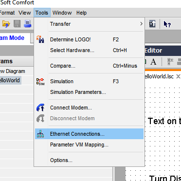

Enter the Logo8 unit's IP details. Now right click on the "Ethernet Connections" icon in the bottom window. Select "Add Server connections" > "Modbus Connect"

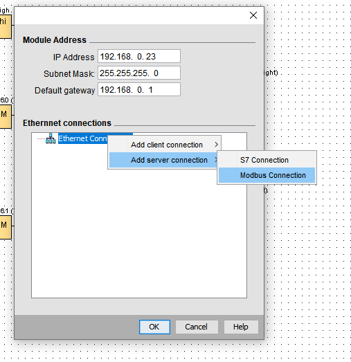

You should now see the Modbus server showing in the lower window

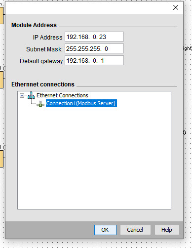

The Logo Blue print will now add a Modbus server when deployed to the Logo8.

## Enable the Webserver on the Logo8
You can also enable the webserver using the Logo!Soft Comfort software via the Tools > Transfer > Access Control... menu in Logo!Soft Comfort. 

Connect to your Logo8 and enable the webserver and set a password

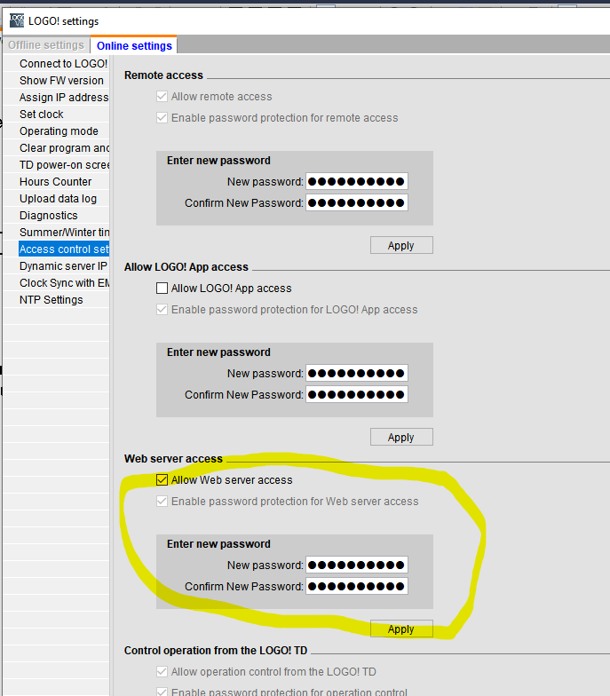

You can use the webserver to test the blueprint before you start configuring Home Assistant.

## Transfer the blueprint to the Logo
Using Logo!Soft Comfort, transfer to the Logo Unit as normal

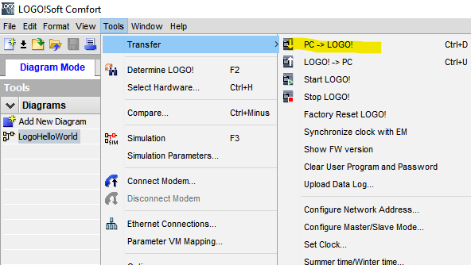

## Testing the blueprint using the Logo8 webserver
Logon to the Logo8 webserver with the blueprint running 

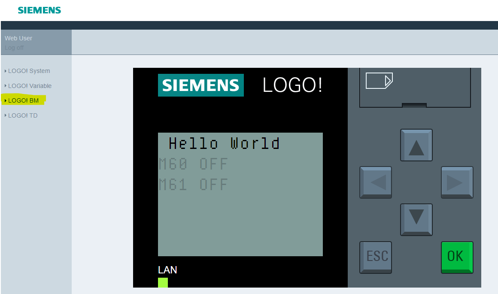

If you like, you can also connect the Logo!Soft comfort software in online mode at the same time to view the internal states of the Logo8.

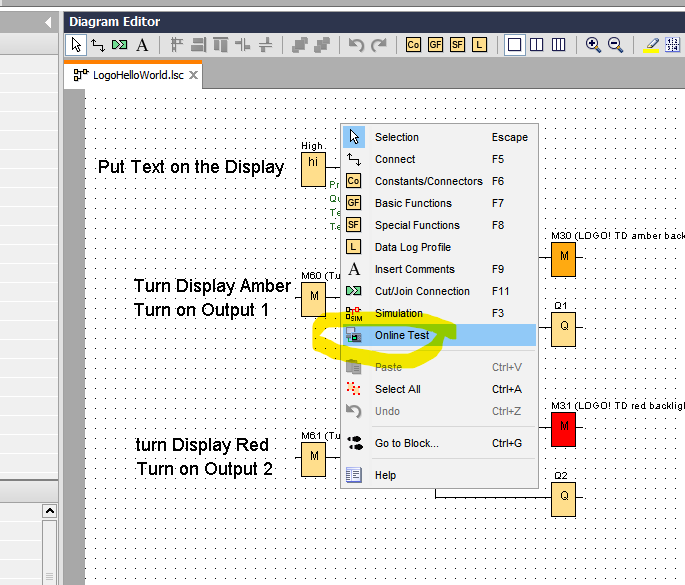

A status bar will appear at the bottom of the screen which shows the state of flags and can also mimic the Logo8 front panel display (the webserver will also mimic the display but won's show the flag states as easily)

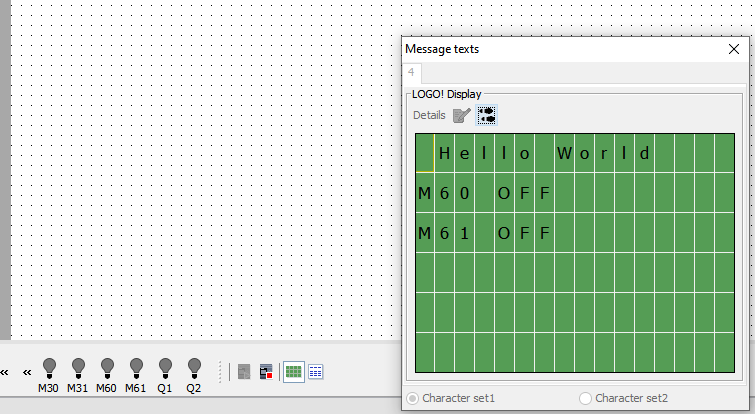

You can now use the webserver to set the Input Flags, testing the blueprint before you test the modbus interface.

In the webinterface, select the LOGO! Variable option. Add a variable and add M > M60 and M > M61 

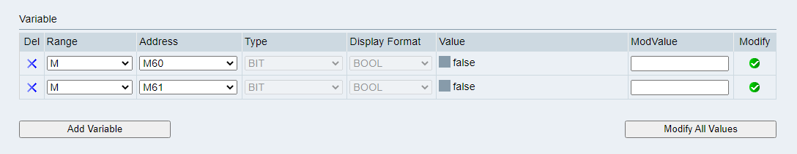

Both should show a value of FALSE. Enter 1 into the M60 ModValue text box and click Modify All Values. 

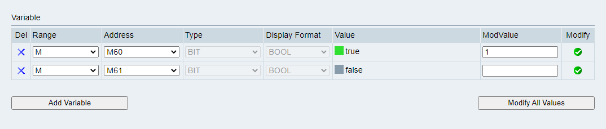

The Q1 relay on the Logo should click on and the screen will update to show it is on

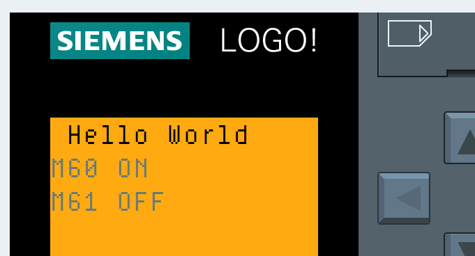

If you had the online connection turned on, the status bar will update

Changing M61's value should also update the display and switch relays. If all that works, you're good to move to the Modbus part.

## Determining the Modbus addresses
This was not easy to work out but there's a brilliant post on the Home Assistant forum which helped me - [here](https://community.home-assistant.io/t/siemens-logo-8/129281/18)

The table included in the post (which I've reproduced here but don't know who created so can't credit the author)

As you can see, the 2 Flags M60 and M61 have Modbus addresses of 8315 and 8316 respectively. As detailed in the forum post, you can access blocks other than just Flags including reading states and analog outputs which Home Assitant can then respond to.

## Home Assistant Setup
Once you have your Logo8 configured and running with the Blueprint, you can add the Modbus integration to the configuration file. Edit the configuration.yaml file - the location of the file depends on how you ran up Home Assistant, I run it in Docker with the Docker container's /config directory mounted onto the Raspberry Pi's /etc/hassio directory, so the location of the configuration file for me is /etc/hassio/configuration.yaml but, if you're running their VM, you need to connect to the command line, then "login" to the shell and then the configuration is in the /mnt/data/supervisor/homeassistant directory.

You'll need to add the Modbus integration to the YAML, specify the Logo8 IP addess and then add entities for the exposed Flags

    modbus:
      - type: tcp
        host: 192.168.0.222
        port: 502
        delay: 2
        switches:
        - name: Turn on Output 1
            address: 8315
            write_type: coil
        - name: Turn on Output 2
            address: 8316
            write_type: coil

You'll need to reload Home Assistant in order for the configuration change to take affect. (use the Home Assitant webpage Developer Tools > YAML > Configuration validation tools to check your YAML syntax if it doesn't work).

This will add 2 switches to the Home Assistant interface called "Turn on Output 1" and "Turn on Output 2" (if you have the default Home Assistant dashboard which automatically adds all entities selected. If you have setup the dashboard manually, you will need to add the new entities to the dashboard).

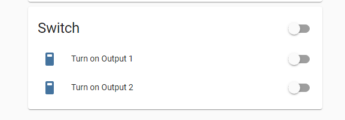

Try toggling them, the Logo8 should switch on and off the outputs - it works!!

You can extend this by reading in values to Home Assistant. For example, to read the state of the outputs (Q1 - Q8 for example), you can setup a binary sensor linked to the Modbus ID of the output.

Looking again at that spreadsheet above, output 1 (Q1) has an ID of 8192 and so you can add it to the modbus section of the configuration file as below;

    modbus:
      - type: tcp
        host: 192.168.0.222
        port: 502
        delay: 2
    ...
        binary_sensors:
        - name: "Is Output 1 On"
            address: 8192
            scan_interval: 20
            input_type: coil

If you add the YAML above to the configuration.yaml and restart Home Assistant, a binary sensor should appear which shows the state of the output Q1 (note that the code above tells Home Assistant to scan every 5 seconds so updates may take up to 5 seconds, you can change this value)

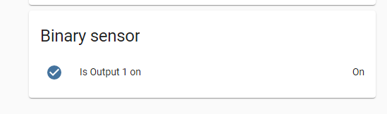

You can add other types of sensor so you can read (and set) analogue values. The [forum post](https://community.home-assistant.io/t/siemens-logo-8/129281/18) mentioned earlier shows how to add an Analog output using the NAQ Logo Block.

## It doesn't work?

### Confirm the Logo8 Blueprint is running OK
Use the webserver interface of the Logo8 to switch the inputs and confirm that changing the input value changes the output relays and also changes the backlight colour of the Logo8.

If this is working fine, check that Home Assistant can talk to the Logo8 using Modbus

### Confirm that Home Assistant can talk to the Logo8
First off, ensure that the home assistant computer can ping the Logo8.

If it can but you "[Errno 104] Connection reset by peer" errors in the Home Assistant Logs, check you have the modbus server added to the project (See "Enable the Modbus server on the Logo8" above).

